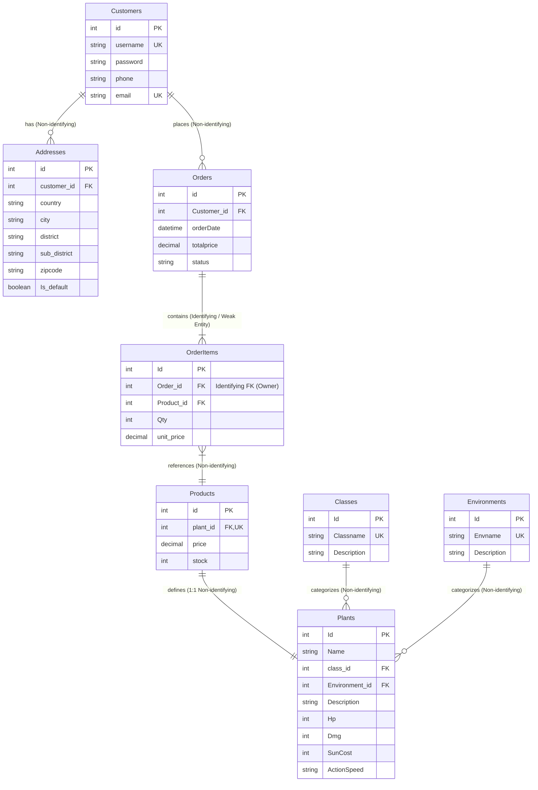

# รายชื่อสมาชิก

1. เมธาสิทธิ์ พิบูลย์ศิลป์ 682110189
2. ปัณณวิชญ์ สิทธิตัน 682110181
3. สิรวิชญ์ ยวงคำ 682110199
4. สายกลาง จะวะนะ 682110198

---

# Data Dictionary & Entity Relationship Diagram (ERD)
## Plants vs Zombie Shop System

---

## 1. Entity Relationship Diagram (ERD)

### การแสดงผลและสัญลักษณ์ใน Diagram (Diagram Notation & Symbols)
- **Crow's Foot Notation**:
  - `||--o{` : ความสัมพันธ์แบบ 1 ต่อ หลาย (One-to-Many, Mandatory 1 on Parent, Optional Many on Child)
  - `||--|{` : ความสัมพันธ์แบบ 1 ต่อ หลาย โดยฝั่ง Child ต้องมีอย่างน้อย 1 รายการ (Mandatory Many)
  - `||--||` : ความสัมพันธ์แบบ 1 ต่อ 1 (One-to-One)
- **Weak Entity & Identifying Relationship Symbol**:
  - ตาราง **`OrderItems`** เป็น **Weak Entity** เนื่องจากต้องพึ่งพาการมีอยู่ของคำสั่งซื้อ (`Orders`)
  - ใน Mermaid Diagram ความสัมพันธ์ใช้เส้นทึบ `||--|{` เพื่อแสดง **Identifying Relationship** (โดยมี `Order_id` เป็น Foreign Key ที่ทำหน้าที่เป็นส่วนหนึ่งของการระบุตัวตนตัว Weak Entity ร่วมกับ `Id` และหาก Parent ถูกลบ รายการใน `OrderItems` จะถูกลบตามแบบ `ON DELETE CASCADE`)

---

## 2. Relational Schemas (ข้อกำหนดโครงสร้างความสัมพันธ์)

การแสดง Relational Schemas ตามรูปแบบมาตรฐาน (Standard Notation):

> **สัญลักษณ์สเปก (Legend):**
> - **ตัวหนาและ<u>ขีดเส้นใต้</u>**: Primary Key (PK)
> - **เครื่องหมาย `*` หรือ `FK`**: Foreign Key (FK)

1. **Customers** (<u>id</u>, username, password, phone, email)
2. **Addresses** (<u>id</u>, customer_id*, country, city, district, sub_district, zipcode, Is_default)
3. **Orders** (<u>id</u>, Customer_id*, orderDate, totalprice, status)
4. **OrderItems** (<u>Id</u>, Order_id*, Product_id*, Qty, unit_price)  *(หมายเหตุ: Order_id เป็น Identifying Foreign Key ของ Weak Entity)*
5. **Products** (<u>id</u>, plant_id*, price, stock)  *(หมายเหตุ: plant_id เป็น Unique Foreign Key รองรับความสัมพันธ์ 1:1)*
6. **Plants** (<u>Id</u>, Name, class_id*, Environment_id*, Description, Hp, Dmg, SunCost, ActionSpeed)
7. **Classes** (<u>Id</u>, Classname, Description)
8. **Environments** (<u>Id</u>, Envname, Description)

---

## 3. การวิเคราะห์และพิสูจน์ระดับนอร์มาลไลเซชัน (3NF Proof & Normalization Analysis)

โครงสร้างฐานข้อมูลระบบ **Plants vs Zombie Shop System** ได้รับการออกแบบตามหลักการ Normalization และพิสูจน์แล้วว่าอยู่ในระดับ **3rd Normal Form (3NF)** ดังรายละเอียด:

### 3.1 First Normal Form (1NF)
- **เกณฑ์พิจารณา**: ทุก Attribute ต้องเก็บค่าที่เป็น Atomic Value (ไม่เป็น Multi-valued หรือ Composite Attributes) และไม่มีกลุ่มข้อมูลซ้ำซ้อน (Repeating Groups)
- **ผลการวิเคราะห์**:
  - ข้อมูลที่อยู่อาศัยถูกแยกเป็นคอลัมน์เดี่ยว (`country`, `city`, `district`, `sub_district`, `zipcode`) ในตาราง `Addresses` ไม่เก็บรวมกันเป็นข้อความเดียว
  - รายการสินค้าในคำสั่งซื้อที่อาจเป็นกลุ่มซ้ำซ้อน (Repeating Groups) ถูกแยกออกมาเป็นตาราง `OrderItems` โดย 1 แถวเก็บเพียง 1 รายการสินค้า
  - ทุก Attribute ในทุกตารางมีค่าเป็น Atomic Value และมี Primary Key ที่ระบุแต่ละ Tuple ได้อย่างชัดเจน จึงผ่านเกณฑ์ **1NF**

### 3.2 Second Normal Form (2NF)
- **เกณฑ์พิจารณา**: ต้องอยู่ในระดับ 1NF และทุก Non-key Attribute ต้องขึ้นตรงต่อ Primary Key ทั้งหมดแบบเต็มตัว (Full Functional Dependency) โดยไม่มี Partial Dependency บน Composite Primary Key
- **ผลการวิเคราะห์**:
  - ตารางที่มี Primary Key แบบคอลัมน์เดียว (`Customers`, `Addresses`, `Orders`, `Products`, `Plants`, `Classes`, `Environments`) จะไม่มีทางเกิด Partial Dependency
  - ตาราง `OrderItems` มี `Qty` และ `unit_price` ขึ้นตรงต่อรายการสินค้าในคำสั่งซื้อนั้นๆ โดยสมบูรณ์ (ต้องทราบทั้ง `Order_id` และรายการนั้นๆ เพื่อระบุราคา ณ ขณะสั่งซื้อ) ไม่ได้ขึ้นตรงต่อเพียง `Product_id` หรือ `Order_id` เพียงส่วนใดส่วนหนึ่ง
  - ทุก Non-key Attribute ขึ้นตรงต่อ Primary Key แบบสมบูรณ์ จึงผ่านเกณฑ์ **2NF**

### 3.3 Third Normal Form (3NF)
- **เกณฑ์พิจารณา**: ต้องอยู่ในระดับ 2NF และไม่มี Transitive Dependency (ไม่มี Non-key Attribute ใดที่ขึ้นตรงต่อ Non-key Attribute อื่น)
- **ผลการวิเคราะห์ขจัด Transitive Dependency**:
  - **การจัดเก็บ `totalprice` ใน `Orders` และ `unit_price` ใน `OrderItems`**:
    - `unit_price` ใน `OrderItems` เป็นการบันทึก Snapshot ของราคา ณ เวลาที่สั่งซื้อจริง ไม่ได้เกิด Transitive Dependency กับ `Products.price` เพราะราคาสินค้าในสต็อกเปลี่ยนขึ้นลงตามเวลาได้
    - `totalprice` ใน `Orders` เป็นราคารวมสุทธิทั้งบิล เพื่อความถูกต้องทางประวัติบัญชี (Historical Accuracy) และประสิทธิภาพการคquery
  - **แยก `Addresses` ออกจาก `Customers`**: เพื่อไม่ให้ข้อมูลที่อยู่อาศัยขึ้นตรงกับข้อมูลผู้ใช้งาน ป้องกันข้อมูลซ้ำซ้อนเมื่อลูกค้ามีหลายที่อยู่
  - **แยก `Products` ออกจาก `Plants` (1:1)**: ข้อมูลเชิงพาณิชย์ (`price`, `stock`) ขึ้นตรงกับ `Products.id` ส่วนข้อมูล Game Stats (`Hp`, `Dmg`, `SunCost`) ขึ้นตรงกับ `Plants.Id`
  - **แยก `Classes` และ `Environments` ออกจาก `Plants` (1:N)**: ขจัด Transitive Dependency เช่น $class\_id \rightarrow Classname$ ออกจาก `Plants`
- **สรุปผล**: ฐานข้อมูลนี้ได้รับการออกแบบและพิสูจน์แล้วว่าอยู่ในระดับ **3rd Normal Form (3NF)** อย่างสมบูรณ์

---

## 4. Data Dictionary (พจนานุกรมข้อมูล)

หมายเหตุ: กำหนดตามสเปกโครงสร้างใน `ERD` พร้อมระบุคอลัมน์ Default Value แยกต่างหากอย่างชัดเจน

### 4.1 Customers (ตารางข้อมูลลูกค้า)

| Field | Data Type | Constraint | Nullable | Default | คำอธิบาย |
|---|---|---|---|---|---|
| `id` | INT | PK, Auto Increment | NOT NULL | - | รหัสลูกค้า |
| `username` | VARCHAR(50) | UNIQUE | NOT NULL | - | ชื่อผู้ใช้สำหรับเข้าสู่ระบบ |
| `password` | VARCHAR(255) | - | NOT NULL | - | รหัสผ่าน (จัดเก็บแบบ hashed) |
| `phone` | VARCHAR(15) | - | NOT NULL | - | เบอร์โทรศัพท์ |
| `email` | VARCHAR(100) | UNIQUE | NOT NULL | - | อีเมลลูกค้า |

---

### 4.2 Addresses (ตารางที่อยู่จัดส่ง)

| Field | Data Type | Constraint | Nullable | Default | คำอธิบาย |
|---|---|---|---|---|---|
| `id` | INT | PK, Auto Increment | NOT NULL | - | รหัสที่อยู่ |
| `customer_id` | INT | FK → Customers.id | NOT NULL | - | รหัสลูกค้าเจ้าของที่อยู่ |
| `country` | VARCHAR(50) | - | NOT NULL | - | ประเทศ |
| `city` | VARCHAR(50) | - | NOT NULL | - | จังหวัด/เมือง |
| `district` | VARCHAR(50) | - | NOT NULL | - | อำเภอ/เขต |
| `sub_district` | VARCHAR(50) | - | NOT NULL | - | ตำบล/แขวง |
| `zipcode` | VARCHAR(10) | - | NOT NULL | - | รหัสไปรษณีย์ |
| `Is_default` | BOOLEAN | - | NOT NULL | `false` | สถานะที่อยู่หลัก (`true` = ที่อยู่หลัก, `false` = ที่อยู่ทั่วไป) |

---

### 4.3 Orders (ตารางคำสั่งซื้อ)

| Field | Data Type | Constraint | Nullable | Default | คำอธิบาย |
|---|---|---|---|---|---|
| `id` | INT | PK, Auto Increment | NOT NULL | - | รหัสคำสั่งซื้อ |
| `Customer_id` | INT | FK → Customers.id | NOT NULL | - | ลูกค้าที่สั่งซื้อ |
| `orderDate` | DATETIME | - | NOT NULL | `CURRENT_TIMESTAMP` | วันที่/เวลาที่สั่งซื้อ |
| `totalprice` | DECIMAL(10,2) | CHECK (totalprice >= 0) | NOT NULL | `0.00` | ราคารวมสุทธิของคำสั่งซื้อ (Grand Total) |
| `status` | VARCHAR(20) | - | NOT NULL | `'pending'` | สถานะคำสั่งซื้อ (เช่น pending, paid, shipped, cancelled) |

---

### 4.4 OrderItems (ตารางรายการสินค้าในคำสั่งซื้อ - Weak Entity)

| Field | Data Type | Constraint | Nullable | Default | คำอธิบาย |
|---|---|---|---|---|---|
| `Id` | INT | PK (Partial Key) | NOT NULL | - | รหัสรายการสินค้าในคำสั่งซื้อ |
| `Order_id` | INT | FK → Orders.id (Identifying Owner) | NOT NULL | - | คำสั่งซื้อที่รายการนี้สังกัดอยู่ (ON DELETE CASCADE) |
| `Product_id` | INT | FK → Products.id | NOT NULL | - | สินค้าที่ถูกสั่งซื้อ |
| `Qty` | INT | CHECK (Qty > 0) | NOT NULL | `1` | จำนวนที่สั่งซื้อ |
| `unit_price` | DECIMAL(10,2) | CHECK (unit_price >= 0) | NOT NULL | - | ราคาขายต่อหน่วย ณ วันเวลาที่ทำรายการสั่งซื้อ |

> **หมายเหตุ (Weak Entity):** เป็น Weak Entity เพราะไม่มีตัวตนที่สมบูรณ์ถ้าไม่มี Orders — ถ้าลบ Order รายการ OrderItems ที่สังกัดจะถูกลบตามไปด้วย (ON DELETE CASCADE)

---

### 4.5 Products (ตารางสินค้า)

| Field | Data Type | Constraint | Nullable | Default | คำอธิบาย |
|---|---|---|---|---|---|
| `id` | INT | PK, Auto Increment | NOT NULL | - | รหัสสินค้า |
| `plant_id` | INT | FK → Plants.Id, UNIQUE | NOT NULL | - | พืชที่สินค้านี้อ้างอิงถึง (1:1 Relationship) |
| `price` | DECIMAL(10,2) | CHECK (price >= 0) | NOT NULL | - | ราคาขายปัจจุบัน |
| `stock` | INT | CHECK (stock >= 0) | NOT NULL | `0` | จำนวนคงเหลือในสต็อก |

---

### 4.6 Plants (ตารางข้อมูลพืช)

| Field | Data Type | Constraint | Nullable | Default | คำอธิบาย |
|---|---|---|---|---|---|
| `Id` | INT | PK, Auto Increment | NOT NULL | - | รหัสพืช |
| `Name` | VARCHAR(100) | - | NOT NULL | - | ชื่อพืช |
| `class_id` | INT | FK → Classes.Id | NOT NULL | - | คลาส/ประเภทของพืช |
| `Environment_id` | INT | FK → Environments.Id | NOT NULL | - | สภาพแวดล้อมที่พืชเจริญเติบโต/ใช้งาน |
| `Description` | TEXT | - | NULL | `NULL` | คำอธิบายพืช |
| `Hp` | INT | CHECK (Hp > 0) | NOT NULL | - | ค่าพลังชีวิต |
| `Dmg` | INT | CHECK (Dmg >= 0) | NOT NULL | - | ค่าความเสียหายที่สร้างได้ |
| `SunCost` | INT | CHECK (SunCost >= 0) | NOT NULL | - | ต้นทุนซันในการใช้พืชนี้ (ตามธีมเกม) |
| `ActionSpeed` | VARCHAR(50) | - | NOT NULL | - | ความเร็วในการโจมตี/ทำงาน |

---

### 4.7 Classes (ตารางคลาสพืช)

| Field | Data Type | Constraint | Nullable | Default | คำอธิบาย |
|---|---|---|---|---|---|
| `Id` | INT | PK, Auto Increment | NOT NULL | - | รหัสคลาสพืช |
| `Classname` | VARCHAR(50) | UNIQUE | NOT NULL | - | ชื่อคลาสพืช (เช่น Attack, Defense, Sun Producer) |
| `Description` | TEXT | - | NULL | `NULL` | คำอธิบายคลาสพืช |

---

### 4.8 Environments (ตารางสภาพแวดล้อม/ด่าน)

| Field | Data Type | Constraint | Nullable | Default | คำอธิบาย |
|---|---|---|---|---|---|
| `Id` | INT | PK, Auto Increment | NOT NULL | - | รหัสสภาพแวดล้อม |
| `Envname` | VARCHAR(50) | UNIQUE | NOT NULL | - | ชื่อสภาพแวดล้อม (เช่น Day, Night, Pool, Fog, Roof) |
| `Description` | TEXT | - | NULL | `NULL` | คำอธิบายสภาพแวดล้อม |

---

## 5. ความสัมพันธ์ทั้งหมด (Relationships)

### 5.1 ตารางสรุปความสัมพันธ์

| ตาราง A | ความสัมพันธ์ | ตาราง B | Foreign Key | ชนิดความสัมพันธ์ (Identifying) |
|---|---|---|---|---|
| **Customers** | 1 : many | **Addresses** | `Addresses.customer_id` | Identifying: No |
| **Customers** | 1 : many | **Orders** | `Orders.Customer_id` | Identifying: No |
| **Orders** | 1 : many | **OrderItems** | `OrderItems.Order_id` | **Identifying: Yes (Weak Entity)** |
| **Products** | 1 : many | **OrderItems** | `OrderItems.Product_id` | Identifying: No |
| **Plants** | 1 : 1 | **Products** | `Products.plant_id` | Identifying: No (Unique FK) |
| **Classes** | 1 : many | **Plants** | `Plants.class_id` | Identifying: No |
| **Environments** | 1 : many | **Plants** | `Plants.Environment_id` | Identifying: No |

---

### 5.2 คำอธิบายรายละเอียดความสัมพันธ์

1. **Customers ↔ Addresses (1 : N)**
   - ลูกค้า 1 คน สามารถมีที่อยู่จัดส่งได้หลายที่อยู่ (1 to Many)
   - ที่อยู่แต่ละแห่งเชื่อมโยงกับลูกค้า 1 คนผ่าน `customer_id`

2. **Customers ↔ Orders (1 : N)**
   - ลูกค้า 1 คน สามารถสร้างคำสั่งซื้อได้หลายคำสั่งซื้อ (1 to Many)
   - คำสั่งซื้อแต่ละรายการเป็นของลูกค้า 1 คนผ่าน `Customer_id`

3. **Orders ↔ OrderItems (1 : N - Weak Entity / Identifying Relationship)**
   - คำสั่งซื้อ 1 รายการ ประกอบด้วยรายการสินค้าได้หลายรายการ (1 to Many)
   - `OrderItems` เป็น **Weak Entity** ที่พึ่งพา `Orders` โดยมี `Order_id` เป็น Identifying Foreign Key (หาก Order ถูกลบ รายการ OrderItems จะถูกลบตามไปด้วยแบบ `ON DELETE CASCADE`)

4. **Products ↔ OrderItems (1 : N)**
   - สินค้า 1 ชนิด สามารถถูกสั่งซื้อในรายการสินค้า (`OrderItems`) ได้หลายครั้ง (1 to Many)
   - แต่ละรายการสั่งซื้ออ้างอิงสินค้า 1 ชนิดผ่าน `Product_id`

5. **Plants ↔ Products (1 : 1)**
   - พืช 1 ชนิด ถูกนำเสนอเป็นสินค้าวางขายเพียง 1 สินค้า (1 to 1)
   - แยกข้อมูลสถิติของพืช (`Plants`) ออกจากข้อมูลการขาย (`Products` เช่น ราคา และสต็อก) โดยมี `plant_id` ใน `Products` เป็น Unique FK

6. **Classes ↔ Plants (1 : N)**
   - คลาสพืช 1 คลาส (เช่น Attack, Defense, Sun Producer) จัดหมวดหมู่พืชได้หลายชนิด (1 to Many)
   - พืชแต่ละชนิดสังกัดคลาส 1 คลาสผ่าน `class_id`

7. **Environments ↔ Plants (1 : N)**
   - สภาพแวดล้อม 1 แบบ (เช่น Day, Night, Pool, Fog, Roof) เหมาะสมกับพืชได้หลายชนิด (1 to Many)
   - พืชแต่ละชนิดระบุสภาพแวดล้อมผ่าน `Environment_id`
