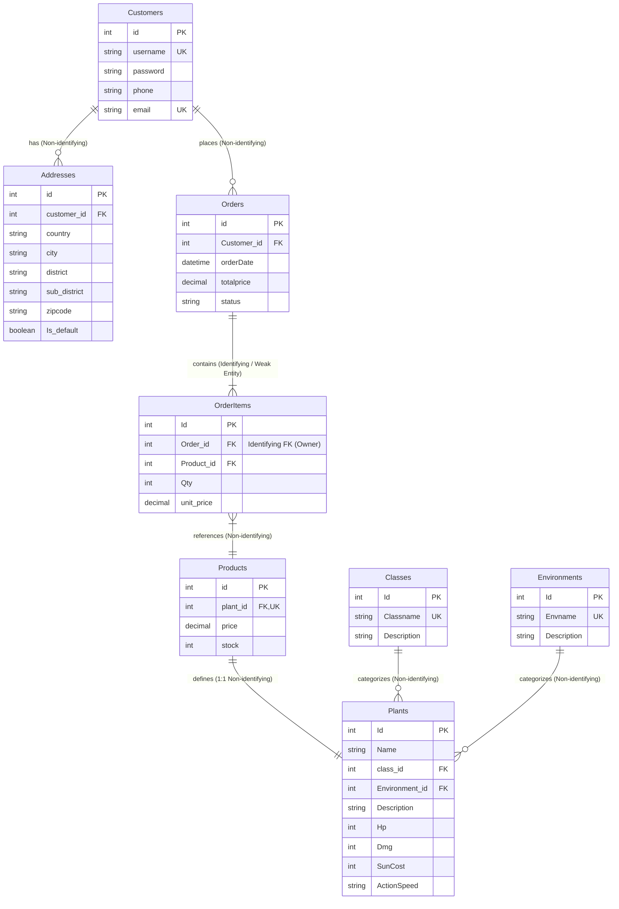

# รายชื่อสมาชิก

1. เมธาสิทธิ์ พิบูลย์ศิลป์ 682110189
2. ปัณณวิชญ์ สิทธิตัน 682110181
3. สิรวิชญ์ ยวงคำ 682110199
4. สายกลาง จะวะนะ 682110198

---

# Plants vs Zombie Shop — Backend Project

An online shop that sells Plants vs Zombie plants, built as a **microservice
backend** with Spring Boot, Spring Data JPA, Eureka, Feign and Kafka.

The database design this project is built on — ERD, relational schemas, 3NF
proof and full data dictionary — is **Part 2** of this document, below.

---

## 1. Overview

A customer browses the plant catalog, places an order, and the rest of the shop
reacts on its own:

1. **order-service** validates the customer and the products, saves the order,
   and announces `OrderPlaced` on a Kafka topic.
2. **inventory-service** hears the announcement and cuts the stock.
3. **notification-service** hears the same announcement and records a message
   for the customer.

Nobody calls those two services. They subscribe. That is the difference between
the synchronous half of the system (Feign) and the asynchronous half (Kafka),
and it is the point of the architecture.

---

## 2. Architecture

```
                         ┌──────────────────────────┐
                         │  naming-server (Eureka)  │  :8761
                         │  every service registers │
                         └──────────────────────────┘
                                     ▲
             ┌───────────────────────┼───────────────────────┐
             │                       │                       │
   ┌─────────────────┐     ┌──────────────────┐   ┌────────────────────┐
   │ catalog-service │     │ customer-service │   │   order-service    │
   │      :8100      │◄────┤      :8200       │   │       :8300        │
   │  (+ :8101 copy) │     └──────────────────┘   └────────────────────┘
   └─────────────────┘              ▲                    │      │
       Plants, Classes,             │  Feign             │      │ Feign
       Environments,                └────────────────────┘      │
       Products                                                 ▼
                                                     ┌─────────────────────┐
                                                     │  Kafka topic:orders │
                                                     └─────────────────────┘
                                                         │            │
                                    inventory-group ◄────┘            └────► notification-group
                                            │                                      │
                                 ┌────────────────────┐                ┌────────────────────────┐
                                 │ inventory-service  │  :8400         │  notification-service  │  :8500
                                 └────────────────────┘                └────────────────────────┘
```

### Services

| Service | Port | Tables it owns | What it does |
| --- | --- | --- | --- |
| `naming-server` | 8761 | — | Eureka registry. Every service registers by name; nobody hard-codes an address. |
| `catalog-service` | 8100 (+8101) | `Plants`, `Classes`, `Environments`, `Products` | The plant catalog and the sale data (price, stock). Full REST: GET / POST / PUT / PATCH / DELETE. Runs as **two instances** to demonstrate load balancing. |
| `customer-service` | 8200 | `Customers`, `Addresses` | Accounts and shipping addresses. |
| `order-service` | 8300 | `Orders`, `OrderItems` | Places orders. Asks customer-service and catalog-service over **Feign**, then **publishes** `OrderPlaced` to Kafka. |
| `inventory-service` | 8400 | — (calls catalog) | **Consumes** `orders` (group `inventory-group`) and reduces `Products.stock` through catalog-service. |
| `notification-service` | 8500 | `Notifications` (service-local) | **Consumes** `orders` (group `notification-group`) and stores a message per order. |

### Why the tables are split this way

The schema in Part 2 is the **logical** model — one consistent design, proven to
3NF. Physically, each service keeps only its own slice in its own H2 database,
because a microservice that shares tables with another one is not independently
deployable.

That has one visible consequence, and it is deliberate:

* Inside a service, relationships stay **JPA relationships** —
  `Plants ↔ Products` is a real `@OneToOne`, `Orders → OrderItems` a real
  `@OneToMany` with cascade.
* Across a service boundary, a foreign key becomes a **plain id**.
  `Orders.Customer_id` and `OrderItems.Product_id` are `Long` fields, not
  `@ManyToOne`, because the row they point at lives in another service's
  database. The join is replaced by a Feign call.

This is the same trade-off as in the class sample: what a JOIN did in one
program now costs an HTTP request.

### Entity relationships (JPA)

| Relationship | Type | Where | Enforced by |
| --- | --- | --- | --- |
| `Classes` → `Plants` | One-to-Many | catalog-service | `@OneToMany(mappedBy="plantClass")` / `@ManyToOne` |
| `Environments` → `Plants` | One-to-Many | catalog-service | `@OneToMany(mappedBy="environment")` / `@ManyToOne` |
| `Plants` ↔ `Products` | One-to-One | catalog-service | `@OneToOne` with unique `plant_id` |
| `Customers` → `Addresses` | One-to-Many | customer-service | `@OneToMany(mappedBy="customer")` |
| `Customers` → `Orders` | One-to-Many | across services | `Orders.customerId` (Long) + Feign |
| `Orders` → `OrderItems` | One-to-Many (weak entity) | order-service | `@OneToMany(cascade=ALL, orphanRemoval=true)` — the `ON DELETE CASCADE` of the schema |
| `Products` → `OrderItems` | Many-to-One | across services | `OrderItems.productId` (Long) + Feign |

---

## 3. REST API

Base path `/api` on every service. All five verbs the rubric asks for live on
the product and plant resources.

### catalog-service (8100)

| Method | Path | Answer |
| --- | --- | --- |
| GET | `/api/plants` · `/api/plants/{id}` | 200, or 404 |
| POST | `/api/plants` | 201 |
| PUT | `/api/plants/{id}` | 200 — full replace, or 404 |
| PATCH | `/api/plants/{id}` | 200 — partial update, or 404 |
| DELETE | `/api/plants/{id}` | 204, or 404 |
| GET | `/api/products` · `/api/products/{id}` | 200, or 404 |
| POST / PUT / PATCH / DELETE | `/api/products` … | 201 / 200 / 200 / 204 |
| PATCH | `/api/products/{id}/stock` | 200 — used by inventory-service |
| GET | `/api/classes` · `/api/environments` | 200 |

### customer-service (8200)

| Method | Path | Answer |
| --- | --- | --- |
| GET / POST / PUT / PATCH / DELETE | `/api/customers` … | 200 / 201 / 200 / 200 / 204 |
| GET / POST | `/api/customers/{id}/addresses` | 200 / 201 |

### order-service (8300)

| Method | Path | Answer |
| --- | --- | --- |
| POST | `/api/orders` | 201 — validates via Feign, saves, publishes to Kafka. 400 for an unknown customer or product |
| GET | `/api/orders` · `/api/orders/{id}` | 200, or 404 |
| PATCH | `/api/orders/{id}` | 200 — e.g. `{"status":"shipped"}` |
| DELETE | `/api/orders/{id}` | 204 — the items go with it (cascade) |

### inventory-service (8400) · notification-service (8500)

| Method | Path | Answer |
| --- | --- | --- |
| GET | `/api/stock-movements` | 200 — what the consumer did |
| GET | `/api/notifications` | 200 |

**PUT vs PATCH.** PUT replaces the whole resource: fields missing from the body
are cleared. PATCH merges: fields missing from the body are left alone. Both
verbs exist because both operations are real, and the same one-field body sent
to each produces the opposite result.

---

## 4. Microservice wiring

### Eureka (service discovery)

* `naming-server` runs `@EnableEurekaServer` on port 8761 with
  `register-with-eureka=false` and `fetch-registry=false` — it *is* the list, so
  it does not register with itself.
* Every other service has `@EnableDiscoveryClient` and points at
  `http://localhost:8761/eureka/`.

### Feign (service-to-service calls)

`order-service` declares interfaces with no implementation:

```java
@FeignClient(name = "catalog-service")
public interface CatalogClient {
    @GetMapping("/api/products/{id}")
    ProductDTO getProduct(@PathVariable("id") Long id);
}
```

The value is a **name**, never a URL. That is what makes the next part possible.

### Load balancer

Because Feign asks for a name, Spring Cloud LoadBalancer resolves it through
Eureka and picks one instance per call — round robin, no configuration.

**How we demonstrate it:** start `catalog-service` twice (8100 and 8101). Every
catalog response carries the port that answered, so calling
`POST /api/orders` repeatedly shows `servedBy` alternating `8100`, `8101`,
`8100`… Nothing in order-service changes.

### Kafka (pub/sub)

| | |
| --- | --- |
| Topic | `orders` |
| Producer | `order-service` — `kafkaTemplate.send(topic, orderJson)` after a successful save |
| Consumer 1 | `inventory-service` — `@KafkaListener(topics="orders", groupId="inventory-group")` |
| Consumer 2 | `notification-service` — `@KafkaListener(topics="orders", groupId="notification-group")` |

The two consumers use **different group ids**, so each group receives its own
copy of every event. If they shared a group, Kafka would treat them as two
copies of one subscriber and split the stream — each event reaching only one of
them.

**Event payload**

```json
{
  "orderId": 1,
  "customerId": 3,
  "totalPrice": 450.00,
  "orderDate": "2026-08-12T14:03:00",
  "items": [ { "productId": 2, "qty": 3, "unitPrice": 150.00 } ]
}
```

**Why events and not a Feign call?** Stopping inventory-service does not stop a
customer buying. The order is still accepted, the event waits in the broker, and
the stock is corrected when the service comes back. A Feign call would have
failed the whole purchase.

---

## 5. Team and ownership

| # | Member | Student ID | Service(s) owned | Also responsible for |
| --- | --- | --- | --- | --- |
| 1 | เมธาสิทธิ์ พิบูลย์ศิลป์ | 682110189 | **order-service** (8300) | Parent `pom.xml` and repo setup · Feign clients · Kafka **producer** |
| 2 | ปัณณวิชญ์ สิทธิตัน | 682110181 | **catalog-service** (8100 + 8101) | 4 entities (Plants, Classes, Environments, Products) · all five REST verbs · the second instance for the load-balancer demo |
| 3 | สิรวิชญ์ ยวงคำ | 682110199 | **customer-service** (8200) · **naming-server** (8761) | Eureka registry · Customers + Addresses |
| 4 | สายกลาง จะวะนะ | 682110198 | **inventory-service** (8400) · **notification-service** (8500) | `docker-compose.yml` for Kafka · both Kafka **consumers** (two different consumer groups) |

> Each member must be able to explain the code in the service they own during the
> demo. The detailed task brief for each service — packages, class names,
> endpoints, JSON contracts and acceptance criteria — is in **[TASKS.md](TASKS.md)**.

---

## 6. Repository layout

```
pvz-shop/
├── docker-compose.yml          zookeeper + kafka
├── pom.xml                     parent (packaging: pom)
├── naming-server/              :8761  Eureka
├── catalog-service/            :8100  Plants, Classes, Environments, Products
├── customer-service/           :8200  Customers, Addresses
├── order-service/              :8300  Orders, OrderItems  (Feign + Kafka producer)
├── inventory-service/          :8400  Kafka consumer  (inventory-group)
└── notification-service/       :8500  Kafka consumer  (notification-group)
```

Each service module holds its own `domain`, `repository`, `dto`, `dto.mapper`
and controllers, plus an `application.properties` with its own in-memory H2 and
a `data.sql` for demo rows.

---

## 7. How to run

```bash
# 1. the broker
docker compose up -d

# 2. build everything, from the top folder
mvn clean install -DskipTests

# 3. start in this order, one terminal each
mvn -pl naming-server         spring-boot:run     # wait for http://localhost:8761
mvn -pl catalog-service       spring-boot:run
mvn -pl customer-service      spring-boot:run
mvn -pl order-service         spring-boot:run
mvn -pl inventory-service     spring-boot:run
mvn -pl notification-service  spring-boot:run

# 4. second copy of catalog-service, for the load balancer demo
mvn -pl catalog-service spring-boot:run "-Dspring-boot.run.arguments=--server.port=8101"
```

Run all tests:

```bash
mvn test
```

### Demo script

```bash
# browse the catalog
curl http://localhost:8100/api/products

# place an order
curl -X POST http://localhost:8300/api/orders \
  -H "Content-Type: application/json" \
  -d '{"customerId":1,"items":[{"productId":1,"qty":3}]}'

# the two consumers reacted, without being called
curl http://localhost:8400/api/stock-movements
curl http://localhost:8500/api/notifications

# the stock really went down
curl http://localhost:8100/api/products/1
```

Then, for the marks:

1. Open <http://localhost:8761> — 2 instances of `CATALOG-SERVICE`, 1 of each other service.
2. POST the same order a few times — `servedBy` alternates between 8100 and 8101.
3. Stop notification-service, place an order (still 201), restart it — it catches up.

---

## 8. Technology

| Concern | Choice |
| --- | --- |
| Framework | Spring Boot 2.x, Java 11 |
| Persistence | Spring Data JPA + Hibernate, H2 in memory (one per service) |
| Wire format | DTOs + MapStruct mappers; entities never leave the controller |
| Service discovery | Netflix Eureka |
| Service-to-service | OpenFeign + Spring Cloud LoadBalancer |
| Messaging | Apache Kafka (topic `orders`, two consumer groups) |
| Build | Maven multi-module |
| Testing | JUnit 5 + MockMvc |

---

## 9. AI usage

| Tool | Used for |
| --- | --- |
| Claude (Anthropic) | Drafting this README from our database design, and scaffolding boilerplate (entity/DTO/mapper/controller skeletons). |
| _add yours_ | _what you used it for_ |

The database design in Part 2 is our own work from the Database course. The
service split, the Kafka event flow and the endpoint list were decided by the
team; AI was used to write boilerplate and documentation from those decisions.
Every member reviewed the code in the service they own and can explain it.

---

## 10. Video presentation

_link here_

---
---

# Part 2 — Database Design

> The section below is the deliverable for the **Database course** and is kept
> here unchanged. It is the logical model this backend is built on.

# Data Dictionary & Entity Relationship Diagram (ERD)
## Plants vs Zombie Shop System

---

## 1. Entity Relationship Diagram (ERD)



### การแสดงผลและสัญลักษณ์ใน Diagram (Diagram Notation & Symbols)
- **Crow's Foot Notation**:
  - `||--o{` : ความสัมพันธ์แบบ 1 ต่อ หลาย (One-to-Many, Mandatory 1 on Parent, Optional Many on Child)
  - `||--|{` : ความสัมพันธ์แบบ 1 ต่อ หลาย โดยฝั่ง Child ต้องมีอย่างน้อย 1 รายการ (Mandatory Many)
  - `||--||` : ความสัมพันธ์แบบ 1 ต่อ 1 (One-to-One)
- **Weak Entity & Identifying Relationship Symbol**:
  - ตาราง **`OrderItems`** เป็น **Weak Entity** เนื่องจากต้องพึ่งพาการมีอยู่ของคำสั่งซื้อ (`Orders`)
  - ใน Mermaid Diagram ความสัมพันธ์ใช้เส้นทึบ `||--|{` เพื่อแสดง **Identifying Relationship** (โดยมี `Order_id` เป็น Foreign Key ที่ทำหน้าที่เป็นส่วนหนึ่งของการระบุตัวตนตัว Weak Entity ร่วมกับ `Id` และหาก Parent ถูกลบ รายการใน `OrderItems` จะถูกลบตามแบบ `ON DELETE CASCADE`)

---

## 2. Relational Schemas (ข้อกำหนดโครงสร้างความสัมพันธ์)

การแสดง Relational Schemas ตามรูปแบบมาตรฐาน (Standard Notation):

> **สัญลักษณ์สเปก (Legend):**
> - **ตัวหนาและ<u>ขีดเส้นใต้</u>**: Primary Key (PK)
> - **เครื่องหมาย `*` หรือ `FK`**: Foreign Key (FK)

1. **Customers** (<u>id</u>, username, password, phone, email)
2. **Addresses** (<u>id</u>, customer_id*, country, city, district, sub_district, zipcode, Is_default)
3. **Orders** (<u>id</u>, Customer_id*, orderDate, totalprice, status)
4. **OrderItems** (<u>Id</u>, Order_id*, Product_id*, Qty, unit_price)  *(หมายเหตุ: Order_id เป็น Identifying Foreign Key ของ Weak Entity)*
5. **Products** (<u>id</u>, plant_id*, price, stock)  *(หมายเหตุ: plant_id เป็น Unique Foreign Key รองรับความสัมพันธ์ 1:1)*
6. **Plants** (<u>Id</u>, Name, class_id*, Environment_id*, Description, Hp, Dmg, SunCost, ActionSpeed)
7. **Classes** (<u>Id</u>, Classname, Description)
8. **Environments** (<u>Id</u>, Envname, Description)

---

## 3. การวิเคราะห์และพิสูจน์ระดับนอร์มาลไลเซชัน (3NF Proof & Normalization Analysis)

โครงสร้างฐานข้อมูลระบบ **Plants vs Zombie Shop System** ได้รับการออกแบบตามหลักการ Normalization และพิสูจน์แล้วว่าอยู่ในระดับ **3rd Normal Form (3NF)** ดังรายละเอียด:

### 3.1 First Normal Form (1NF)
- **เกณฑ์พิจารณา**: ทุก Attribute ต้องเก็บค่าที่เป็น Atomic Value (ไม่เป็น Multi-valued หรือ Composite Attributes) และไม่มีกลุ่มข้อมูลซ้ำซ้อน (Repeating Groups)
- **ผลการวิเคราะห์**:
  - ข้อมูลที่อยู่อาศัยถูกแยกเป็นคอลัมน์เดี่ยว (`country`, `city`, `district`, `sub_district`, `zipcode`) ในตาราง `Addresses` ไม่เก็บรวมกันเป็นข้อความเดียว
  - รายการสินค้าในคำสั่งซื้อที่อาจเป็นกลุ่มซ้ำซ้อน (Repeating Groups) ถูกแยกออกมาเป็นตาราง `OrderItems` โดย 1 แถวเก็บเพียง 1 รายการสินค้า
  - ทุก Attribute ในทุกตารางมีค่าเป็น Atomic Value และมี Primary Key ที่ระบุแต่ละ Tuple ได้อย่างชัดเจน จึงผ่านเกณฑ์ **1NF**

### 3.2 Second Normal Form (2NF)
- **เกณฑ์พิจารณา**: ต้องอยู่ในระดับ 1NF และทุก Non-key Attribute ต้องขึ้นตรงต่อ Primary Key ทั้งหมดแบบเต็มตัว (Full Functional Dependency) โดยไม่มี Partial Dependency บน Composite Primary Key
- **ผลการวิเคราะห์**:
  - ตารางที่มี Primary Key แบบคอลัมน์เดียว (`Customers`, `Addresses`, `Orders`, `Products`, `Plants`, `Classes`, `Environments`) จะไม่มีทางเกิด Partial Dependency
  - ตาราง `OrderItems` มี `Qty` และ `unit_price` ขึ้นตรงต่อรายการสินค้าในคำสั่งซื้อนั้นๆ โดยสมบูรณ์ (ต้องทราบทั้ง `Order_id` และรายการนั้นๆ เพื่อระบุราคา ณ ขณะสั่งซื้อ) ไม่ได้ขึ้นตรงต่อเพียง `Product_id` หรือ `Order_id` เพียงส่วนใดส่วนหนึ่ง
  - ทุก Non-key Attribute ขึ้นตรงต่อ Primary Key แบบสมบูรณ์ จึงผ่านเกณฑ์ **2NF**

### 3.3 Third Normal Form (3NF)
- **เกณฑ์พิจารณา**: ต้องอยู่ในระดับ 2NF และไม่มี Transitive Dependency (ไม่มี Non-key Attribute ใดที่ขึ้นตรงต่อ Non-key Attribute อื่น)
- **ผลการวิเคราะห์ขจัด Transitive Dependency**:
  - **การจัดเก็บ `totalprice` ใน `Orders` และ `unit_price` ใน `OrderItems`**:
    - `unit_price` ใน `OrderItems` เป็นการบันทึก Snapshot ของราคา ณ เวลาที่สั่งซื้อจริง ไม่ได้เกิด Transitive Dependency กับ `Products.price` เพราะราคาสินค้าในสต็อกเปลี่ยนขึ้นลงตามเวลาได้
    - `totalprice` ใน `Orders` เป็นราคารวมสุทธิทั้งบิล เพื่อความถูกต้องทางประวัติบัญชี (Historical Accuracy) และประสิทธิภาพการคquery
  - **แยก `Addresses` ออกจาก `Customers`**: เพื่อไม่ให้ข้อมูลที่อยู่อาศัยขึ้นตรงกับข้อมูลผู้ใช้งาน ป้องกันข้อมูลซ้ำซ้อนเมื่อลูกค้ามีหลายที่อยู่
  - **แยก `Products` ออกจาก `Plants` (1:1)**: ข้อมูลเชิงพาณิชย์ (`price`, `stock`) ขึ้นตรงกับ `Products.id` ส่วนข้อมูล Game Stats (`Hp`, `Dmg`, `SunCost`) ขึ้นตรงกับ `Plants.Id`
  - **แยก `Classes` และ `Environments` ออกจาก `Plants` (1:N)**: ขจัด Transitive Dependency เช่น $class\_id \rightarrow Classname$ ออกจาก `Plants`
- **สรุปผล**: ฐานข้อมูลนี้ได้รับการออกแบบและพิสูจน์แล้วว่าอยู่ในระดับ **3rd Normal Form (3NF)** อย่างสมบูรณ์

---

## 4. Data Dictionary (พจนานุกรมข้อมูล)

หมายเหตุ: กำหนดตามสเปกโครงสร้างใน `ERD` พร้อมระบุคอลัมน์ Default Value แยกต่างหากอย่างชัดเจน

### 4.1 Customers (ตารางข้อมูลลูกค้า)

| Field | Data Type | Constraint | Nullable | Default | คำอธิบาย |
|---|---|---|---|---|---|
| `id` | INT | PK, Auto Increment | NOT NULL | - | รหัสลูกค้า |
| `username` | VARCHAR(50) | UNIQUE | NOT NULL | - | ชื่อผู้ใช้สำหรับเข้าสู่ระบบ |
| `password` | VARCHAR(255) | - | NOT NULL | - | รหัสผ่าน (จัดเก็บแบบ hashed) |
| `phone` | VARCHAR(15) | - | NOT NULL | - | เบอร์โทรศัพท์ |
| `email` | VARCHAR(100) | UNIQUE | NOT NULL | - | อีเมลลูกค้า |

---

### 4.2 Addresses (ตารางที่อยู่จัดส่ง)

| Field | Data Type | Constraint | Nullable | Default | คำอธิบาย |
|---|---|---|---|---|---|
| `id` | INT | PK, Auto Increment | NOT NULL | - | รหัสที่อยู่ |
| `customer_id` | INT | FK → Customers.id | NOT NULL | - | รหัสลูกค้าเจ้าของที่อยู่ |
| `country` | VARCHAR(50) | - | NOT NULL | - | ประเทศ |
| `city` | VARCHAR(50) | - | NOT NULL | - | จังหวัด/เมือง |
| `district` | VARCHAR(50) | - | NOT NULL | - | อำเภอ/เขต |
| `sub_district` | VARCHAR(50) | - | NOT NULL | - | ตำบล/แขวง |
| `zipcode` | VARCHAR(10) | - | NOT NULL | - | รหัสไปรษณีย์ |
| `Is_default` | BOOLEAN | - | NOT NULL | `false` | สถานะที่อยู่หลัก (`true` = ที่อยู่หลัก, `false` = ที่อยู่ทั่วไป) |

---

### 4.3 Orders (ตารางคำสั่งซื้อ)

| Field | Data Type | Constraint | Nullable | Default | คำอธิบาย |
|---|---|---|---|---|---|
| `id` | INT | PK, Auto Increment | NOT NULL | - | รหัสคำสั่งซื้อ |
| `Customer_id` | INT | FK → Customers.id | NOT NULL | - | ลูกค้าที่สั่งซื้อ |
| `orderDate` | DATETIME | - | NOT NULL | `CURRENT_TIMESTAMP` | วันที่/เวลาที่สั่งซื้อ |
| `totalprice` | DECIMAL(10,2) | CHECK (totalprice >= 0) | NOT NULL | `0.00` | ราคารวมสุทธิของคำสั่งซื้อ (Grand Total) |
| `status` | VARCHAR(20) | - | NOT NULL | `'pending'` | สถานะคำสั่งซื้อ (เช่น pending, paid, shipped, cancelled) |

---

### 4.4 OrderItems (ตารางรายการสินค้าในคำสั่งซื้อ - Weak Entity)

| Field | Data Type | Constraint | Nullable | Default | คำอธิบาย |
|---|---|---|---|---|---|
| `Id` | INT | PK (Partial Key) | NOT NULL | - | รหัสรายการสินค้าในคำสั่งซื้อ |
| `Order_id` | INT | FK → Orders.id (Identifying Owner) | NOT NULL | - | คำสั่งซื้อที่รายการนี้สังกัดอยู่ (ON DELETE CASCADE) |
| `Product_id` | INT | FK → Products.id | NOT NULL | - | สินค้าที่ถูกสั่งซื้อ |
| `Qty` | INT | CHECK (Qty > 0) | NOT NULL | `1` | จำนวนที่สั่งซื้อ |
| `unit_price` | DECIMAL(10,2) | CHECK (unit_price >= 0) | NOT NULL | - | ราคาขายต่อหน่วย ณ วันเวลาที่ทำรายการสั่งซื้อ |

> **หมายเหตุ (Weak Entity):** เป็น Weak Entity เพราะไม่มีตัวตนที่สมบูรณ์ถ้าไม่มี Orders — ถ้าลบ Order รายการ OrderItems ที่สังกัดจะถูกลบตามไปด้วย (ON DELETE CASCADE)

---

### 4.5 Products (ตารางสินค้า)

| Field | Data Type | Constraint | Nullable | Default | คำอธิบาย |
|---|---|---|---|---|---|
| `id` | INT | PK, Auto Increment | NOT NULL | - | รหัสสินค้า |
| `plant_id` | INT | FK → Plants.Id, UNIQUE | NOT NULL | - | พืชที่สินค้านี้อ้างอิงถึง (1:1 Relationship) |
| `price` | DECIMAL(10,2) | CHECK (price >= 0) | NOT NULL | - | ราคาขายปัจจุบัน |
| `stock` | INT | CHECK (stock >= 0) | NOT NULL | `0` | จำนวนคงเหลือในสต็อก |

---

### 4.6 Plants (ตารางข้อมูลพืช)

| Field | Data Type | Constraint | Nullable | Default | คำอธิบาย |
|---|---|---|---|---|---|
| `Id` | INT | PK, Auto Increment | NOT NULL | - | รหัสพืช |
| `Name` | VARCHAR(100) | - | NOT NULL | - | ชื่อพืช |
| `class_id` | INT | FK → Classes.Id | NOT NULL | - | คลาส/ประเภทของพืช |
| `Environment_id` | INT | FK → Environments.Id | NOT NULL | - | สภาพแวดล้อมที่พืชเจริญเติบโต/ใช้งาน |
| `Description` | TEXT | - | NULL | `NULL` | คำอธิบายพืช |
| `Hp` | INT | CHECK (Hp > 0) | NOT NULL | - | ค่าพลังชีวิต |
| `Dmg` | INT | CHECK (Dmg >= 0) | NOT NULL | - | ค่าความเสียหายที่สร้างได้ |
| `SunCost` | INT | CHECK (SunCost >= 0) | NOT NULL | - | ต้นทุนซันในการใช้พืชนี้ (ตามธีมเกม) |
| `ActionSpeed` | VARCHAR(50) | - | NOT NULL | - | ความเร็วในการโจมตี/ทำงาน |

---

### 4.7 Classes (ตารางคลาสพืช)

| Field | Data Type | Constraint | Nullable | Default | คำอธิบาย |
|---|---|---|---|---|---|
| `Id` | INT | PK, Auto Increment | NOT NULL | - | รหัสคลาสพืช |
| `Classname` | VARCHAR(50) | UNIQUE | NOT NULL | - | ชื่อคลาสพืช (เช่น Attack, Defense, Sun Producer) |
| `Description` | TEXT | - | NULL | `NULL` | คำอธิบายคลาสพืช |

---

### 4.8 Environments (ตารางสภาพแวดล้อม/ด่าน)

| Field | Data Type | Constraint | Nullable | Default | คำอธิบาย |
|---|---|---|---|---|---|
| `Id` | INT | PK, Auto Increment | NOT NULL | - | รหัสสภาพแวดล้อม |
| `Envname` | VARCHAR(50) | UNIQUE | NOT NULL | - | ชื่อสภาพแวดล้อม (เช่น Day, Night, Pool, Fog, Roof) |
| `Description` | TEXT | - | NULL | `NULL` | คำอธิบายสภาพแวดล้อม |

---

## 5. ความสัมพันธ์ทั้งหมด (Relationships)

### 5.1 ตารางสรุปความสัมพันธ์

| ตาราง A | ความสัมพันธ์ | ตาราง B | Foreign Key | ชนิดความสัมพันธ์ (Identifying) |
|---|---|---|---|---|
| **Customers** | 1 : many | **Addresses** | `Addresses.customer_id` | Identifying: No |
| **Customers** | 1 : many | **Orders** | `Orders.Customer_id` | Identifying: No |
| **Orders** | 1 : many | **OrderItems** | `OrderItems.Order_id` | **Identifying: Yes (Weak Entity)** |
| **Products** | 1 : many | **OrderItems** | `OrderItems.Product_id` | Identifying: No |
| **Plants** | 1 : 1 | **Products** | `Products.plant_id` | Identifying: No (Unique FK) |
| **Classes** | 1 : many | **Plants** | `Plants.class_id` | Identifying: No |
| **Environments** | 1 : many | **Plants** | `Plants.Environment_id` | Identifying: No |

---

### 5.2 คำอธิบายรายละเอียดความสัมพันธ์

1. **Customers ↔ Addresses (1 : N)**
   - ลูกค้า 1 คน สามารถมีที่อยู่จัดส่งได้หลายที่อยู่ (1 to Many)
   - ที่อยู่แต่ละแห่งเชื่อมโยงกับลูกค้า 1 คนผ่าน `customer_id`

2. **Customers ↔ Orders (1 : N)**
   - ลูกค้า 1 คน สามารถสร้างคำสั่งซื้อได้หลายคำสั่งซื้อ (1 to Many)
   - คำสั่งซื้อแต่ละรายการเป็นของลูกค้า 1 คนผ่าน `Customer_id`

3. **Orders ↔ OrderItems (1 : N - Weak Entity / Identifying Relationship)**
   - คำสั่งซื้อ 1 รายการ ประกอบด้วยรายการสินค้าได้หลายรายการ (1 to Many)
   - `OrderItems` เป็น **Weak Entity** ที่พึ่งพา `Orders` โดยมี `Order_id` เป็น Identifying Foreign Key (หาก Order ถูกลบ รายการ OrderItems จะถูกลบตามไปด้วยแบบ `ON DELETE CASCADE`)

4. **Products ↔ OrderItems (1 : N)**
   - สินค้า 1 ชนิด สามารถถูกสั่งซื้อในรายการสินค้า (`OrderItems`) ได้หลายครั้ง (1 to Many)
   - แต่ละรายการสั่งซื้ออ้างอิงสินค้า 1 ชนิดผ่าน `Product_id`

5. **Plants ↔ Products (1 : 1)**
   - พืช 1 ชนิด ถูกนำเสนอเป็นสินค้าวางขายเพียง 1 สินค้า (1 to 1)
   - แยกข้อมูลสถิติของพืช (`Plants`) ออกจากข้อมูลการขาย (`Products` เช่น ราคา และสต็อก) โดยมี `plant_id` ใน `Products` เป็น Unique FK

6. **Classes ↔ Plants (1 : N)**
   - คลาสพืช 1 คลาส (เช่น Attack, Defense, Sun Producer) จัดหมวดหมู่พืชได้หลายชนิด (1 to Many)
   - พืชแต่ละชนิดสังกัดคลาส 1 คลาสผ่าน `class_id`

7. **Environments ↔ Plants (1 : N)**
   - สภาพแวดล้อม 1 แบบ (เช่น Day, Night, Pool, Fog, Roof) เหมาะสมกับพืชได้หลายชนิด (1 to Many)
   - พืชแต่ละชนิดระบุสภาพแวดล้อมผ่าน `Environment_id`

